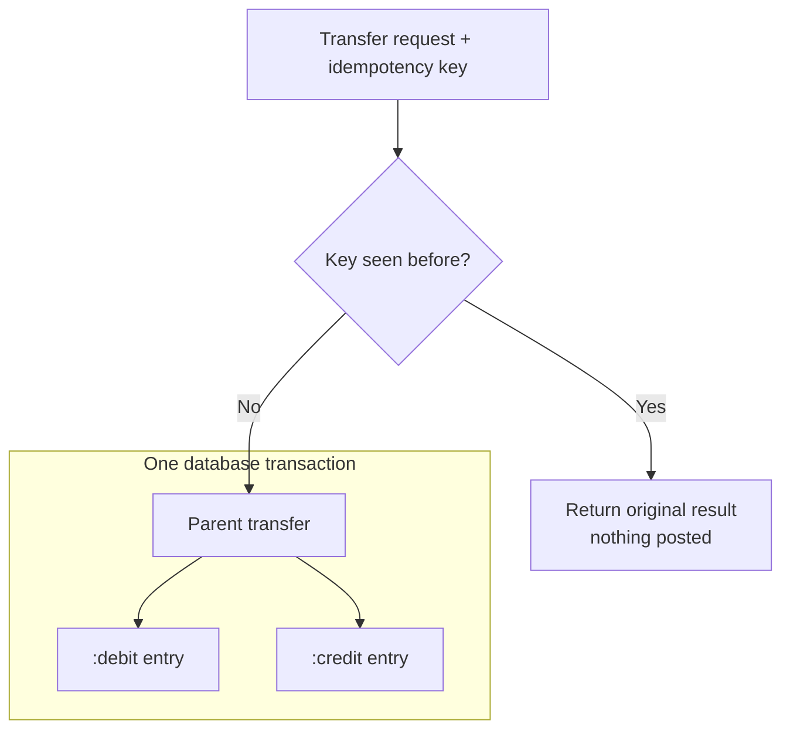
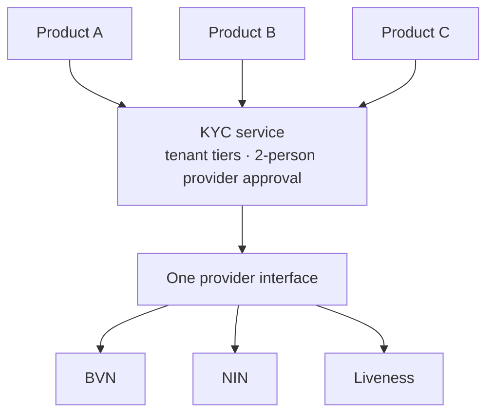

# Hi, I'm Sinmiloluwa Oloyede

**Backend engineer. I build the parts of fintech that move money.**

I have over 5 years of experience shipping backend systems. Right now that means double-entry ledgers, payment integrations and identity verification at Afrinvest West Africa.

   📄 [Resume (PDF)](./Sinmiloluwa_Oloyede_Resume.pdf) &nbsp;|&nbsp; 💼 [LinkedIn](https://www.linkedin.com/in/sinmiloluwa-oloyede-94962511b) &nbsp;|&nbsp; ✉️ [soloyede97@gmail.com](mailto:soloyede97@gmail.com)

---

## Production work

These systems are running in production at Afrinvest West Africa. The code is proprietary, so it isn't public, but I'm happy to walk through the design and code in an interview.

### 1. Plutus Neo, a consumer investment platform · [plutusneo.ng](https://www.plutusneo.ng/)

Users fund digital wallets, run structured savings plans and invest, either manually or through automated recurring deposits and portfolio allocation.

- **Autosave:** I built the autosave feature, which automatically moves money into users' savings plans so they save without having to act each time.
- **Funding sources:** I used the Strategy Pattern to manage multiple funding sources, such as Paystack Direct Debit and Pay with Transfer through dynamic virtual accounts. Each source is its own strategy, separate from transaction processing, so a new source can be added without touching core services.
- **Investing:** backend services for US stock investing through DriveWealth, including customer onboarding and Good Faith Violation checks on cash accounts, which stop trades from being funded with money that hasn't settled.
- **Reliability:** I added structured logging and application performance monitoring, and reworked the database schema and indexes for peak-time load.
- **Outcome:** maintainability improved by about 30% as new funding sources plugged in without core changes, incident resolution time fell by 40%, and peak-time query latency dropped as the user base grew.

`Laravel` `Strategy Pattern` `Paystack` `DriveWealth` 

### 2. Wallet transfers on a double-entry ledger

**Problem:** a client that timed out and retried could post the same transfer twice, and in a ledger that means money appears or disappears.

**Approach:** each transfer creates a parent record keyed by an idempotency key, and its debit and credit entries carry keys derived from it. A retry finds the parent and returns the original result. The parent and both entries are written in one database transaction, with amounts in kobo to avoid rounding errors.

**Outcome:** duplicate postings are prevented by design, so a whole class of reconciliation problems can't happen.

`Laravel` `Double-entry accounting` `Idempotency`

### 3. Multi-tenant Know Your Customer (KYC) service

**Problem:** several financial products each had identity checks wired straight to specific providers. Switching a provider, or giving one product different rules, meant code changes across several codebases.

**Approach:** one standalone service. Every provider sits behind a single interface, so Bank Verification Number (BVN), National Identification Number (NIN) and liveness checks share one contract. Each tenant owns its configuration and defines verification tiers as sets of required checks, and the service validates that each higher tier includes everything below it. Switching a provider needs approval from two people.

**Outcome:** provider changes became controlled configuration decisions instead of engineering projects, and every integration can be tested in isolation with a mock provider.

 `Adapter pattern` `Multi-tenancy` `BVN and NIN`

---

## Open source

**[Laravel DTO Mapper](https://github.com/Sinmiloluwa/laravel-dto-mapper)**: a zero-config PHP library that maps loosely typed data, such as Eloquent models, API responses and request arrays, into strict, typed data transfer objects (DTOs). It uses PHP 8 attributes to remove boilerplate.

## Other projects

- **[Social Todo List](https://github.com/Sinmiloluwa/social-todo-list)**: a social productivity platform with real-time collaboration through shared "Accountability Circles."
- **[Social Voice App](https://github.com/Sinmiloluwa/voice-app)**: a voice-driven Flutter app with real-time voice input and intent processing.

---

## Experience

| Role | Company | Dates |
|---|---|---|
| Backend Engineer | Afrinvest West Africa, Lagos | Aug 2022 – present |
| Backend Engineer | IJGB, Lagos | May 2025 – Jul 2025 |
| Software Engineer | TechTrend Africa, United Kingdom | May 2021 – Jul 2022 |
| Software Engineer | Renager Ltd, Ibadan | Mar 2020 – Apr 2021 |

**Education:** B.Sc. Wood Products Engineering, University of Ibadan, 2021

## Stack

**Languages:** PHP, JavaScript, Dart, Python
**Frameworks:** Laravel, Node.js, NestJS, Express, Flutter
**Payments:** Paystack, Stripe Connect
**Cloud and DevOps:** AWS (EC2, S3, RDS), Docker, GitHub Actions

---

Open to backend engineering roles [Email me](mailto:soloyede97@gmail.com).
